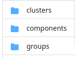
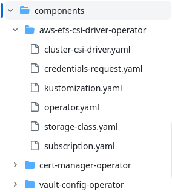
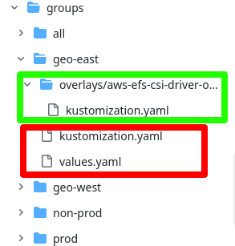

# GitOps standard folder layout for OpenShift multi-cluster day-two configurations

As the title suggest this standard layout is laser focused on addressing the infrastructure configurations (a.k.a. day-two) for a multi-cluster deployment of OpenShift.

TL;DR: jump to the [getting started](#getting-started-with-this-repo) section.

## Repo Structure

These are the main folders:



### Components

This folder contains all of the root pieces of configurations, these are sometime also called structural part of the configuration, as opposed to the parametric part that depends on groups and clusters. Each piece of configuration resides in its own subfolder. These components should never derive from anything (i.e. their resources and components lists in the `kustomization.yaml` file are empty).



For more examples and starter configurations for components, see the [Gitops Catalog](https://github.com/redhat-cop/gitops-catalog).

### Groups

This folder contains common pieces of configurations that can be applied to a group of clusters. Groups can capture concepts like the purpose of the cluster (lab,non-prod, prod), the geography of the cluster (west, east, dc1, dc2), the security profile of the cluster (pci, non-pci, connected, disconnected) etc...

Groups are designed to be composable. So, based on the example groups from above, one should be able to express that a cluster belongs to the non-prod, east, pci groups.

Composition of groups is possible because groups are defined as kustomize [components](https://kubectl.docs.kubernetes.io/references/kustomize/kustomization/components/):

```yaml
apiVersion: kustomize.config.k8s.io/v1alpha1
kind: Component
```

The `all` group almost always exists and it captures the configuration that goes in every cluster.

Each group has it own folder. Within this folder, we can find two things: 

- A set of folders containing the group-specific overlays over some set of components.
- A root level kustomization that generates the ArgoCD applications for this group, using the [argocd-app-of-app](.helm/charts/argocd-app-of-app/) helm chart. See the [all group](./groups/all/kustomization.yaml) for example.



In this example, in green you can see the overlays over one component, while in red you can see the resources needed to generate the Argocd Applications for this group.

### Clusters

This folder contains the cluster-specific configurations. As for groups it is made of two parts:

- A set of folders containing the cluster-specific overlays over some set of components.
- A root level kustomization that generates the ArgoCD applications for this group, using the [argocd-app-of-app](.helm/charts/argocd-app-of-app/) helm chart. This kustomization must import the correct groups for this cluster, here is an example:

```yaml
apiVersion: kustomize.config.k8s.io/v1beta1
kind: Kustomization

components:
  - ../../groups/all
  - ../../groups/non-prod
  - ../../groups/geo-east
```

See also the [hub cluster](./clusters/hub/kustomization.yaml) for example

## Design Decisions

In no particular order, here are the design decisions that guides us to this current folder structure.

- ArgoCD Applications for the [App of App pattern](https://argo-cd.readthedocs.io/en/stable/operator-manual/cluster-bootstrapping/#app-of-apps-pattern) are generated via a Helm chart. This was chosen over the ApplicationSet approach. The reason of this choice is that The ApplicationSet controller seems a bit unstable and that helm charts offer mode flexibly.
- Kustomize is the primary templating mechanism, if one needs to use helm charts, that is still possible via the Kustomize [HelmChartInflaterGenerator](https://kubectl.docs.kubernetes.io/references/kustomize/builtins/#_helmchartinflationgenerator_). The reason of this choice are that Kustomize is easy to pick up in general so starting with kustomize is easier for new users. Also having kustomize at the top level provides homogeneity. This without losing flexibly as one can always use helm charts. 
- Groups of clusters a modeled via Kustomize components, this way they can be composed as opposed to being inherited giving more flexibility.

## Conventions

components names

sync waves

## Getting started with this repo

Press the `Use This Template` button at the right top corner of this page and follow the github instructions to create a detached copy of this repo.

Once you have a copy of this repo in your organization, you have to seed your Hub cluster to point to this repo.

To do so you can simply run this commands, however you might want to implement these steps in different ways in your environment:

```sh
export gitops_repo=<your newly created repo>
export cluster_name=<your hub cluster name, typically "hub">
oc apply -f .bootstrap/subscription.yaml
oc apply -f .bootstrap/cluster-rolebinding.yaml
oc apply -f .bootstrap/argocd.yaml
envsubst < .bootstrap/root-application.yaml | oc apply -f -
```

Note: for pedagogical reason this repo contains some example of components, groups and clusters, you will have to likely remove these examples and start adding the configurations you actually need.

### Local tools & setup

In order to work with this repo effectively, you'll need the following tools installed locally:

- [oc](https://docs.openshift.com/container-platform/4.14/cli_reference/openshift_cli/getting-started-cli.html#installing-openshift-cli)
- [helm](https://helm.sh/docs/intro/install/)
- [kustomize](https://kubectl.docs.kubernetes.io/installation/kustomize/binaries/)

### Debugging

Most debugging and troubleshooting can be done by rendering the root app of apps locally using helm & kustomize. Here are a few examples.

Which applications are currently included in the `hub` cluster?

```bash
kustomize build clusters/hub/ --enable-helm
```

Which applications are part of the `non-prod` group?

```bash
kustomize build groups/non-prod/ --enable-helm
```

## Use cases

### Pinning and Promotions

We use the concept of git repository pinning to version and then promote configurations. Pinning can be done via tagging or directly referencing commit SHAs.
Promoting always consists of changing the pinned version. Depending on where you pin you can manage to promote a single configuration in a individual cluster or all of the configurations in a group for individual clusters ir all of the configurations for a cluster ( and more combinations are even possible).

#### Component configuration Pinning and Promotion

To pin a component to a specific version, use pinning when importing it in a cluster level or group level configuration. This will look like this in the values file for the cluster/group:

```yaml
applications:

  cert-manager-operator:
    annotations:
      argocd.argoproj.io/compare-options: IgnoreExtraneous
      argocd.argoproj.io/sync-wave: '5'
    destination:
      namespace: cert-manager
    source:
      path: components/cert-manager-operator
      targetRevision: <pin>
```


#### group configuration pinning and promotion

In order to pin an entire group-level configuration for a given cluster, pin the component in the kustomization file, like this:

```yaml
apiVersion: kustomize.config.k8s.io/v1beta1
kind: Kustomization

components:
  - ../../groups/all
  - https://github.com/raffaelespazzoli/gitops-std-repo/groups/non-prod?ref=v1.0.6
  - ../../groups/geo-east

```

#### cluster configuration pinning and promotion

In order to version pin an entire cluster configuration, you need to do the pinning at the app of app root level. We have so far not talked about how the app of app so created, but the pinning would look like this:

```yaml
apiVersion: argoproj.io/v1alpha1
kind: Application
metadata:
  name: root-applications
  # You'll usually want to add your resources to the argocd namespace.
  namespace: openshift-gitops
  # Add this finalizer ONLY if you want these to cascade delete.
  finalizers:
    # The default behaviour is foreground cascading deletion
    - resources-finalizer.argocd.argoproj.io
    # Alternatively, you can use background cascading deletion
    # - resources-finalizer.argocd.argoproj.io/background
  # Add labels to your application object.
  labels:
    app-source: root
    repo: cluster-config
spec:
  # The project the application belongs to.
  project: default

  # Source of the application manifests
  source:
    repoURL: ${gitops_repo}  # Can point to either a Helm chart repo or a git repo.
    targetRevision: <pin>  # For Helm, this refers to the chart version.
    path: clusters/${cluster_name}  # This has no meaning for Helm charts pulled directly from a Helm repo instead of git.
...
```

again using the `targetRevision` field.

### how to bootstrap a newly create/registered cluster with gitops

### how to pass cluster-level variables to all of the configurations

